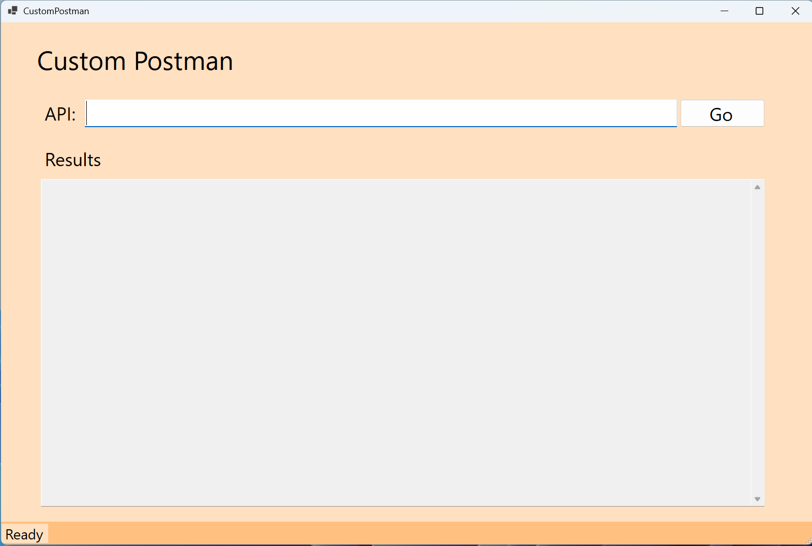
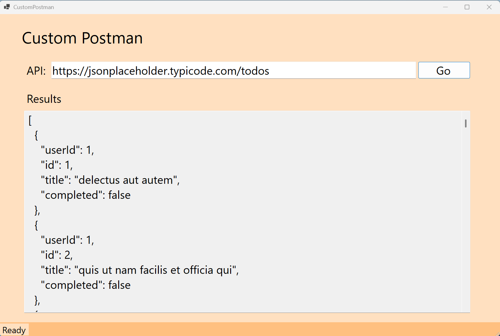

# CustomPostman
Custom Postman is an easy custom made api client to make Get/Post/Put/Patch/Delete requests and handlethe returnable responses in a readable JSON format, This will be ideal for any API testing a developer may need.

## Technologies Used
* C#
* .NET8
* WinForms
* HttpClient

## Using The App
1. Download the .exe file from the release section
2. On launch the application should look like this:

3. Populate the API URL and hit go:

## Upcoming Changes
* Supports for Post/Put/Patch/Delete calls
* Support for API Headers
* Support for Api Authentication
* Dependency Injection + Logging
* Web based interface extensibility
* Google Chrome extension functionality
